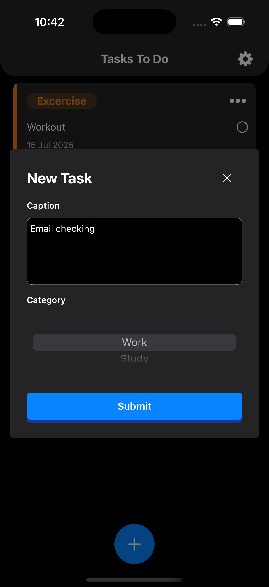
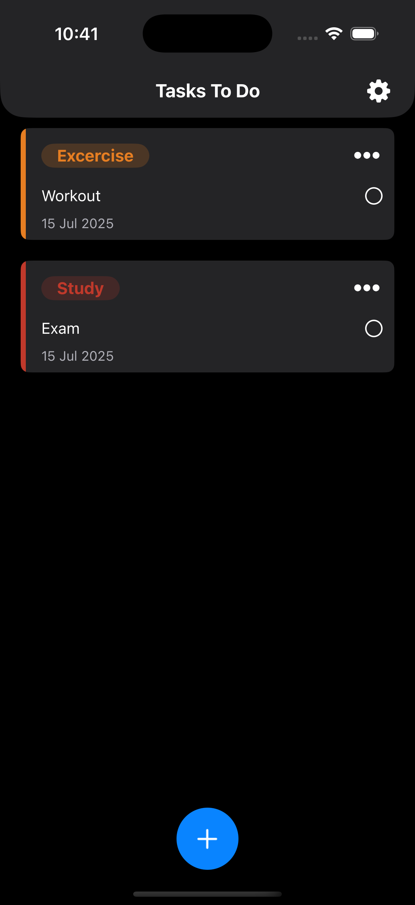

# ToDoList App
The ToDoList App is a simple and intuitive mobile application designed to help users manage their daily tasks efficiently. It allows users to easily add, mark as complete, and delete tasks, ensuring they stay organized and productive. 
# Screenshots

  
  

## License
ToDoList App is released under MIT License. [See license](https://github.com/Liyanasiyad/ToDoList/blob/main/LICENSE) for details
